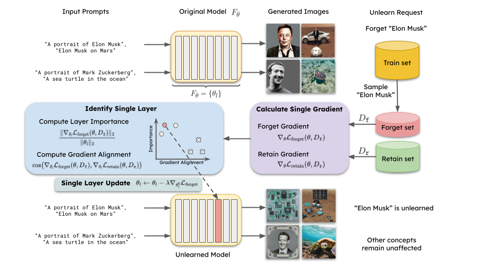
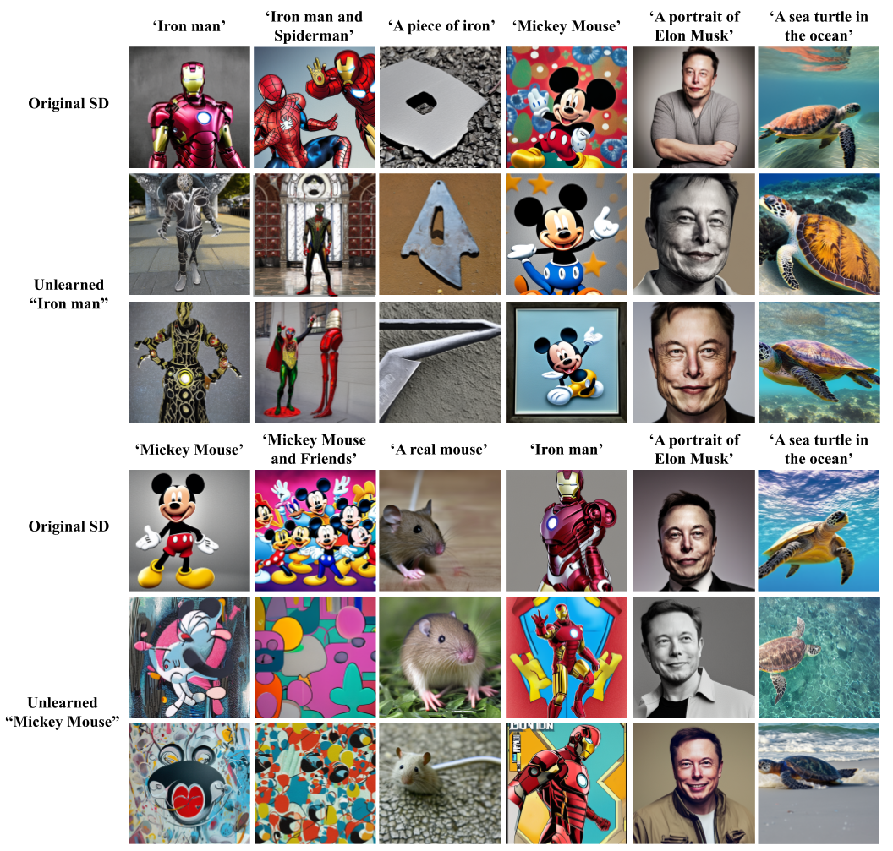

# 🐛SLUG: Single Layer Unlearning Gradient for Targeted Information Unlearning

### [Preprint](https://arxiv.org/abs/2407.11867) | [Code](https://github.com/CSIPlab/slug)

This is the official code repository of *Unlearning Targeted Information via Targeted Single Layer Unlearning Gradient*.

 [Zikui Cai](https://zikuicai.github.io/), [Yaoteng Tan](https://ytengtan.github.io/), [M. Salman Asif](https://intra.ece.ucr.edu/~sasif/)<br>
 UC Riverside 
 

## Abstract
Unauthorized privacy-related and copyrighted content generation using generative-AI has becoming a significant concern for human society, raising ethical, legal, and privacy issues that demand urgent attention. The EU's General Data Protection Regulation (GDPR) include a ``right to be forgotten,'' which allows individuals to request the deletion of their personal data. However, this primarily applies to data stored in traditional databases, not AI models.

## SLUG framework



Overview of our proposed Single Layer Unlearning Gradient (SLUG) framework. Given an unlearning query, such as removing an identity like Elon Musk, we first curate or generate a forget set containing relevant data and a retain set with data points we want to preserve. Using these datasets, we calculate and store the model gradients. Based on these gradients, we identify the important layers to update for unlearning. We then take a step along the forget gradients of a single layer and evaluate the model's unlearning performance. To determine a suitable step size $\lambda$, we employ a binary search. After unlearning, the specified concepts are effectively erased while retaining the model's overall utility.


### Examples of Unlearning on Stable Diffusion

Qualitative evaluation on unlearning copyright characters **Iron man** and **Mickey Mouse**, which can potentially used for unauthorized content generation, from the Stable Diffusion (SD). Our method precisely unlearned copyright protected concepts from SD, while the image generation quality on other concepts is highly preserved.


## 📋 Requirements

To install requirements:

```setup
conda env create -f environment.yml
```


### Datasets (put under data folder):
- laion-400M, the training set of CLIP model, from which we sample foget set and retain set. First download the parquet files, and then use img2dataset to download the images, use the following [code](https://github.com/rom1504/img2dataset/blob/main/dataset_examples/laion400m.md). The image-text pairs are stored in tar files such as `00000.tar`, 00001.tar and so on. We provide files related to shard 00000 as an example data in this [Google Drive](https://drive.google.com/drive/folders/1K8DCnw3B56hUcxF-8SYWYo-AY1uLAWC1?usp=sharing).
- ImageNet 2012. We use the imagenet validation set to evaluate CLIP model general performance. Official request access [here](https://www.image-net.org/download.php), or download from this [Google Drive](https://drive.google.com/drive/folders/1K8DCnw3B56hUcxF-8SYWYo-AY1uLAWC1?usp=sharing).  Download and unzip `ILSVRC2012_img_val.tar` under `data/ImageNet/`, and run `bash valprep.sh` to prepare the dataset.
- CelebA. We sample identities in CelebA dataset to forget. The dataset is available here https://mmlab.ie.cuhk.edu.hk/projects/CelebA.html, or through this [Google Drive](https://drive.usercontent.google.com/download?id=0B7EVK8r0v71pZjFTYXZWM3FlRnM&authuser=0). Request the dataset authors for the name of identities.

Update `data_root` in `src/clip/a0_eval_celeba.py` to the **absolute path** of where you stored the experimental data.

### Data folder structure

The `data` folder is structured as:
```text
data
├── celeba
│   ├── img_align_celeba
│   │   ├── 010905.jpg
│   │   ├── 010906.jpg
│   │   └── ...
│   └── list_identity_celeba.txt
├── ImageNet
│   └── val
│       ├── n01440764
│       │   ├── ILSVRC2012_val_00000293.JPEG
│       │   ├── ILSVRC2012_val_00002138.JPEG
│       │   └── ...
│       ├── n01443537
│       └── ...
├── laion
    └── laion400m
        ├── 00000_stats.json
        ├── 00000.parquet
        └── 00000.tar
```


## 📝 Unlearning procedure

1. Prepare a forget and a retain set. Given an unlearning task, we first curate a forget set containing relevant image-text pairs, then select a retain set.

2. Calculate the gradient from the forget and retain sets.

   Update the route for arguments `--train-data`, `--forget-data`, and `--imagenet-val` in `scripts/run_clip_name.sh`, then run
```setup
bash scripts/run_compute_grad.sh
```
This will generate the forgetting gradient file stored at `muwa/src/results/grads`.

3. Perform the _Single Layer Single Gradient_ update by running
```setup
bash scripts/run_unlearn.sh
```

### Unlearning other celebrity name / object concept
1. Create the forget set dataset file
```setup
python src/clip/a0_create_tar.py --name [celebrity name/object concept]
```
This will create a directory with selected images that are associated with provided celebrity name/concept from laion shard file, under `data/laion/laion400m`.
And a `.tar` file containing the selected images, under `data/tar_files/{concept_name}.tar`.

2. Repeat the unlearning procedure to generate unlearning gradient using the created `.tar` file, and perform unlearning.

TODO: include experiment steps for unlearning object/multiple identities

### Unlearning experiment on Stable diffusion
Before start, generate necessary dataset files and gradient files following steps described in _Unlearning procedure_.
Run Jupyter notebook `notebooks/experiment_stable_diffusion.ipynb`

### Unlearning experiment on Vision-language models
Before start, generate necessary dataset files and gradient files following steps described in _Unlearning procedure_.
Run Jupyter notebook `notebooks/experiment_vision_language.ipynb`

## Evaluation on UnlearnCanvas
First clone [UnlearnCanvas](https://github.com/OPTML-Group/UnlearnCanvas) repository under `./data`
```setup
cd data
git clone https://github.com/OPTML-Group/UnlearnCanvas.git
```
Download UnlearnCanvas dataset and pretraind models following the instructions of UnlearnCanvas repository.
The UnlearnCanvas dataset folder is structured as:

```text
data
└── UnlearnCanvas
    └── data
        ├── Abstractionism
        │   ├── Architectures
        │   │   ├── 1.jpg
        │   │   ├── 2.jpg
        │   │   └── ...
        │   ├── Bears
        │   ├── Birds
        │   └── ...
        ├── Artist_Sketch
        └── ...
```
Generate `.tar` dataset files by running:
```setup
cd src/clip
python a0_create_tar_ucanvas.py
```

Following the same step as above (2.) to generate gradient files for each `.tar` forget set.
Note the 

Lastly, run UnlearnCanvas evaluation:
```setup
bash scripts/run_uncanvas.sh
```


### Pre-trained gradient files and experimental forget sets
We upload pre-trained gradient files and the corresponding forget set `.tar` files to this [Google Drive](https://drive.google.com/drive/folders/1K8DCnw3B56hUcxF-8SYWYo-AY1uLAWC1?usp=sharing).

TODO: upload gradient files to a google drive for fast reproducibility verifications.


## Citation
Please consider citing our work if you find it helpful:

```latex
@article{cai2024single,
  title={Single Layer Single Gradient Unlearning},
  author={Cai, Zikui and Tan, Yaoteng and Asif, M Salman},
  journal={arXiv preprint arXiv:2407.11867},
  year={2024}
}
```
